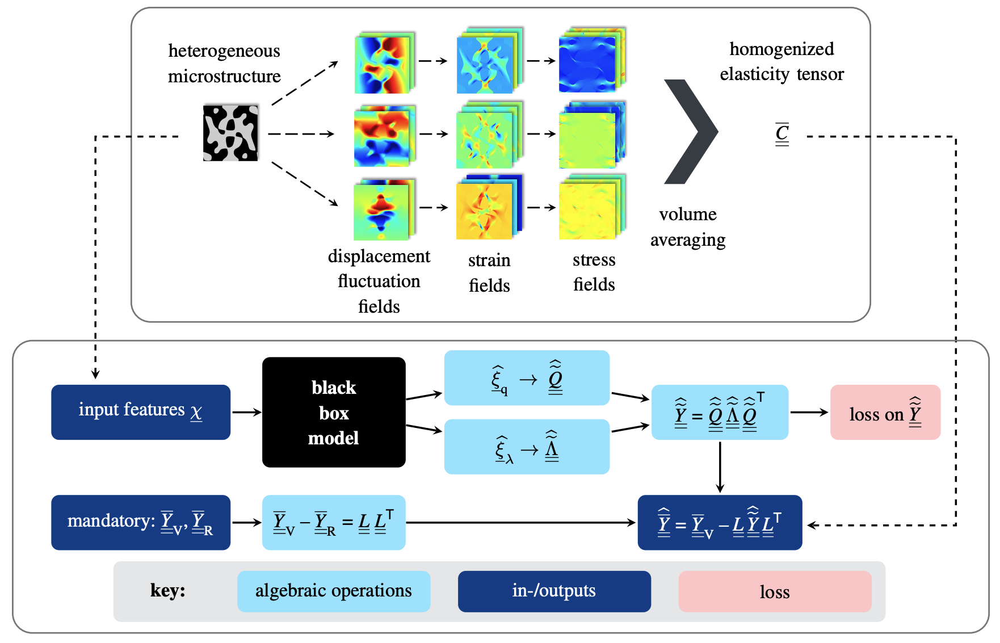

[](https://pixi.sh)


[](https://www.gnu.org/licenses/lgpl-3.0.html)
[](https://github.com/DataAnalyticsEngineering/VoigtReussNet/pulls)

# Voigt-Reuss net: A universal approach to microstructure‐property forecasting with physical guarantees

Surrogates for microstructure–property linkages that inherently fulfill the Voigt-Reuss bounds.

[](https://doi.org/10.48550/arXiv.2511.11388)
[](https://doi.org/10.18419/DARUS-5730)


This repository contains the code and acts as an extension to the article: **"Robust inverse material design with physical guarantees using the Voigt-Reuss Net"** by Sanath Keshav and Felix Fritzen - [https://doi.org/10.48550/arXiv.2511.11388](https://doi.org/10.48550/arXiv.2511.11388). 

[](https://doi.org/10.1002/gamm.70005)
[](https://doi.org/10.18419/DARUS-5120)

This repository contains the code and acts as an extension to the article: **"Spectral Normalization and Voigt-Reuss net: A universal approach to microstructure‐property forecasting with physical guarantees"** published in GAMM Mitteilungen by Sanath Keshav, Julius Herb, and Felix Fritzen - [https://doi.org/10.1002/gamm.70005](https://doi.org/10.1002/gamm.70005).

## Summary

Heterogeneous materials are crucial for producing lightweight, functional components and structures. A crucial step in the design process is the rapid evaluation of their effective mechanical, thermal, or, in general, constitutive properties. The established procedure is to use forward models that accept microstructure geometry and local constitutive properties as inputs. The classical simulation-based approach, e.g., using finite elements and FFT-based solvers, can require substantial computational resources. At the same time, simulation-based models struggle to provide gradients with respect to the microstructure and the constitutive parameters. Such gradients, however, are of paramount importance for microstructure design and for inverting the microstructure-property mapping. Machine learning surrogates can excel in these situations. However, they can lead to unphysical predictions that violate essential bounds on the constitutive response, such as the upper (Voigt-like) or the lower (Reuss-like) bound in linear elasticity. Therefore, we propose a novel spectral normalization scheme that enforces these bounds a priori. The approach is fully agnostic with respect to the chosen microstructural features and the utilized surrogate model: It can be linked to neural networks, kernel methods, or combined schemes. All of these will automatically and strictly predict outputs that obey the upper and lower bounds by construction. The technique can be used for any symmetric constitutive tensor with upper and lower bounds (in the Löwner sense), i.e., for permeability, thermal conductivity, linear elasticity, and many more.

In this GitHub repository, we demonstrate the use of spectral normalization in the Voigt-Reuss net. Numerical examples on truly large datasets illustrate the improved accuracy, robustness, and independence of the input feature type.



## Installation

The project uses [Pixi](https://prefix.dev/docs/pixi/overview) for dependency management. If you don't have Pixi installed, you can install it using:

```bash
curl -fsSL https://pixi.sh/install.sh | sh
```

To set up your isolated environment with all the required packages installed:

```bash
# Clone the repository
git clone https://github.com/DataAnalyticsEngineering/VoigtReussNet.git
cd VoigtReussNet

# Activate the environment (all dependencies pre-installed!)
pixi shell
```

## Download Datasets

The datasets used in the examples are made publicly available on [DaRUS](https://doi.org/10.18419/DARUS-5120). You can download them using the following script:

```bash
cd data
bash download_data.sh
```

## Examples
The [``examples/``](examples/) contains a collection of scripts and Jupyter notebooks demonstrating the implementation and evaluation of different examples for microstructure-property forecasting.

### 2D Thermal Problem

- [`train_vrnn_therm2d.py`](examples/Thermal_2D/train_vrnn_therm2d.py) : Voigt-Reuss network training script for 2D thermal homogenization problem.
- [`train_vann_therm2d.py`](examples/Thermal_2D/train_vann_therm2d.py) : Vanilla neural network training script for 2D thermal homogenization problem.

See also our [demonstrator](https://github.com/DataAnalyticsEngineering/nfdi-demonstrator) for an interactive example!

### 3D Thermal Problem

- [`train_vrnn_therm3d.py`](examples/Thermal_3D/train_vrnn_therm3d.py) : Voigt-Reuss network training script for 3D thermal homogenization problem.
- [`train_vann_therm3d.py`](examples/Thermal_3D/train_vann_therm3d.py) : Vanilla neural network training script for 3D thermal homogenization problem.

### 2D Mechanical Problem

- [`train_vrnn_weights_mech2d.py`](examples/Mechanical_2D/train_vrnn_weights_mech2d.py) : Voigt-Reuss network training script for 2D mechanical homogenization problem.
- [`train_vann_weights_mech2d.py`](examples/Mechanical_2D/train_vann_weights_mech2d.py) : Vanilla neural network training script for 2D mechanical homogenization problem.
- [`train_cholnn_weights_mech2d.py`](examples/Mechanical_2D/train_cholnn_weights_mech2d.py) : Cholesky neural network training script for 2D mechanical homogenization problem.

### 3D Mechanical Problem

- [`train_vrnn_mech3d.py`](examples/Mechanical_3D/train_vrnn_mech3d.py) : Voigt-Reuss network training script for 3D mechanical homogenization problem.
- [`train_vann_mech3d.py`](examples/Mechanical_3D/train_vann_mech3d.py) : Vanilla neural network training script for 3D mechanical homogenization problem.
- [`train_cholnn_mech3d.py`](examples/Mechanical_3D/train_cholnn_mech3d.py) : Cholesky neural network training script for 3D mechanical homogenization problem.

## Acknowledgments
- Contributions by Sanath Keshav are supported by the consortium NFDI-MatWerk, funded by the Deutsche Forschungsgemeinschaft (DFG, German Research Foundation) under the National Research Data Infrastructure – NFDI 38/1 – project number 460247524.

- Funded by Deutsche Forschungsgemeinschaft (DFG, German Research Foundation) under Germany’s Excellence Strategy - EXC 2075 – 390740016. Contributions by Felix Fritzen are funded by Deutsche Forschungsgemeinschaft (DFG, German Research Foundation) within the Heisenberg program DFGFR2702/8 - 406068690 and DFG-FR2702/10 - 517847245.

- Contributions of Julius Herb are partially funded by the Ministry of Science, Research, and the Arts (MWK) Baden-Württemberg, Germany, within the Artificial Intelligence Software Academy (AISA).

- We acknowledge the support by the Stuttgart Center for Simulation Science (SimTech).

## Contact

If you have questions or need support, please open an [issue](https://github.com/DataAnalyticsEngineering/VoigtReussNet/issues).
You can contact [Sanath Keshav](https://github.com/sanathkeshav) (keshav.@mib.uni-stuttgart.de) with any other inquiries.

---
